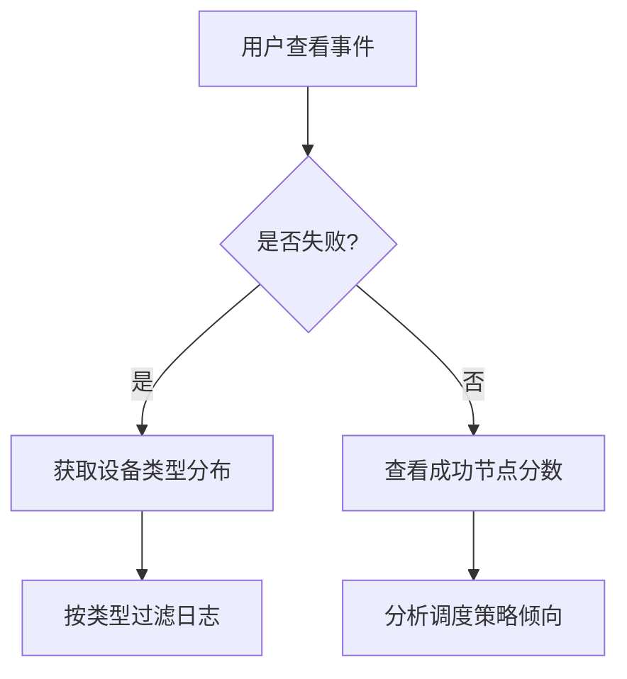

# 调度器事件与日志优化提案

---

## 一、当前问题分析

### 1.1 事件信息缺乏维度统计
- **Pending Pod 事件模糊**  
  现有事件仅显示 `no available node`，无法展示以下关键信息：
    - 异构节点类型失败分布（如 NVIDIA/Ascend/Cambricon 节点数量）

- **Running Pod 缺乏回溯信息**  
  成功调度的 Pod 无法查看：
    - 失败节点的类型分布（如 NVIDIA/Ascend/Cambricon 节点数量）
    - 成功节点的调度分数（解释调度决策依据）

### 1.2 日志可追溯性不足
- **多协程日志交叉输出**  
  节点打分过程并行处理时，日志条目无法关联到具体 Pod/节点：
  ```log
  # 原始日志（无法区分 Pod 和节点）
  I0422 13:42:30.272827 1 scheduler.go:499] All node scores do not meet
  ```

---

## 二、优化设计方案

### 2.1 事件（Event）增强

#### **事件模板**
| 场景                 | 事件格式                                                                                     |
|----------------------|--------------------------------------------------------------------------------------------|
| **调度失败**         | `Warning FilteringFailed  No available nodes: {total} nodes not fit ({type:count,...})`    |
| **调度成功**         | `Normal FilteringSucceed  Scheduled on {node}, {total} nodes not fit ({type:count}), {total} nodes fit ({node:score})` |

#### **示例**
```markdown
# 调度失败事件（混合设备类型）
Events:
  Type     Reason            Age    From            Message
  ----     ------            ----   ----            -------
  Warning  FilteringFailed   2m45s  hami-scheduler  No available nodes: 6 nodes not fit (nvidia:3, ascend:2, cambricon:1)

# 调度成功事件（含分数详情）
Events:
  Type     Reason            Age    From            Message
  ----     ------            ----   ----            -------
  Normal  FilteringSucceed   3s     hami-scheduler  Scheduled on node3, 7 nodes not fit (ascend:5, cambricon:2), 3 nodes fit (node3:0.95, node5:0.82)
```

---

### 2.2 日志（Log）分级
#### **层级定义**
| 级别  | 目标场景                   | 日志内容示例                                                                 |
|-------|----------------------------|------------------------------------------------------------------------------|
| `v=4` | 节点级调度决策总览         | `Node unfit: pod="gpu-pod" node="node3" gpuType="NVIDIA" reasons="InsufficientMemory×3"` |
| `v=5` | 设备级资源冲突详情         | `Device conflict: pod="gpu-pod" node="node5" device="GPU-1" reason="ExclusiveConflict"` |

#### **日志规范**
```log
# v=4 日志（节点级聚合）
(v=4)I0725 09:00:00.000001 scheduler.go:501] node_unfit pod="gpu-pod" node="node3" gpu_type="NVIDIA" reasons="InsufficientMemory:3,ExclusiveConflict:1"

# v=5 日志（设备级详情）
(v=5)I0725 09:00:00.000002 scheduler.go:501] device_conflict pod="gpu-pod" node="node3" device="GPU-0" reason="InsufficientMemory" requested="16Gi" available="10Gi"
```

---

## 三、预期效果

### 3.1 问题定位效率提升
| 场景               | 优化前                                  | 优化后                                                                 |
|--------------------|----------------------------------------|----------------------------------------------------------------------|
| **显存不足**       | 需查看全部日志人工统计                 | 事件直接显示 `nvidia:3 (InsufficientMemory)`                        |
| **设备独占冲突**   | 无法区分冲突设备类型                   | 日志精确到 `device="GPU-7" reason="ExclusiveConflict"`              |

### 3.2 可观测性增强


---

## 四、附录：验证用例

### 4.1 测试场景 - 显存不足
**操作**：请求 16GB NVIDIA GPU，集群仅有 3 个 NVIDIA 节点（可用显存 10GB/12GB/14GB）  
**输出**：
```markdown
# 事件
Warning  FilteringFailed   5s   hami-scheduler  No available nodes: 3 nodes not fit (nvidia:3)

# v=4 日志
(v=4)I0725 09:00:00.000001 scheduler.go:501] node_unfit pod="gpu-pod" node="node3" gpu_type="NVIDIA" reasons="InsufficientMemory:3"

# v=5 日志
(v=5)I0725 09:00:00.000002 scheduler.go:501] device_conflict pod="gpu-pod" node="node3" device="GPU-0" reason="InsufficientMemory" requested="16Gi" available="10Gi"
```

### 4.2 测试场景 - 设备独占冲突
**操作**：请求独占 NVIDIA GPU，目标节点已有 Pod 占用  
**输出**：
```markdown
# 事件
Warning  FilteringFailed   5s   hami-scheduler  No available nodes: 1 node not fit (nvidia:1)

# v=5 日志
(v=5)I0725 09:00:00.000003 scheduler.go:501] device_conflict pod="gpu-pod" node="node5" device="GPU-1" reason="ExclusiveConflict" conflict_pod="training-job-xyz"
```
